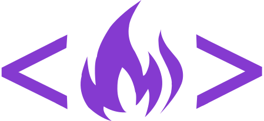
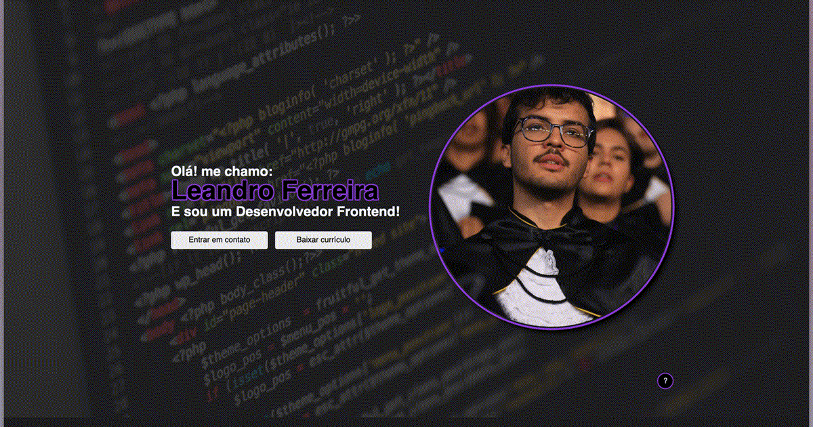

# Portfolio Website

Language: 
  
  

Coding Language/Framework: 
  
  
  
  

Tools: 
  
  
  
  

  

## Demonstração

[Portfólio](https://leandrodev.xyz)

## Descrição

Este projeto esta sendo feito no decorrer de minha carreira!

É um trabalho com muito esforço e paixão.

### Praticado:
  1. React router, redux, icons applied
  2. Utilização do bundler Vite
  3. Hosteamento pelo Github Pages

## Demo

[Portfólio](https://leandrodev.xyz)

## Description

This project has been ongoing throughout my career!

Its a job of passion and effor.

### Practiced:
  1. React router, redux, icons applied
  2. Vite bundler utilized
  3. Hosting from Github Pages